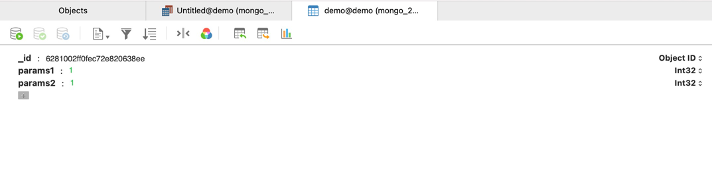
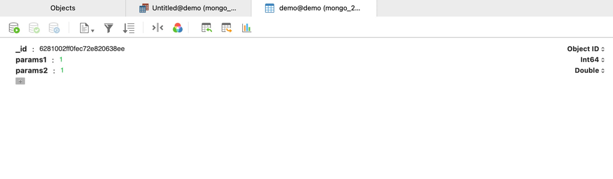

# Mongodb 笔记

## Mongodb 使用需要避免的"坑"

### 前提

mongodb版本是 4.4.14

```shell
root@8163d7b355e7:/# mongo --version
MongoDB shell version v4.4.14
Build Info: {
    "version": "4.4.14",
    "gitVersion": "0b0843af97c3ec9d2c0995152d96d2aad725aab7",
    "openSSLVersion": "OpenSSL 1.1.1f  31 Mar 2020",
    "modules": [],
    "allocator": "tcmalloc",
    "environment": {
        "distmod": "ubuntu2004",
        "distarch": "x86_64",
        "target_arch": "x86_64"
    }
}
root@8163d7b355e7:/# 
```

#### 建立一张demo表并，初始化两条int32类型的数据

```shell
db.demo.insert({"params1" : NumberInt(1),"params2" : NumberInt(1)})
```

如下


##### mongodb bson类型查询表

> bson 每个数据类型都有一个相应的数字和字符串别名，可以与$ type运算符一起使用BSON类型查询文档。

| Type | Number | Alias | Notes |
| :----: | :----:  | :----: | :----: |
| Double |    1 | double |  |
| String | 2 | string |  |
| Object | 3 | object |  |
| Array | 4 | array |  |
| Binary data     | 5 | binData  |  |
| Undefined | 6 | undefined |  |
| ObjectId | 7 | objectId |  |
| Boolean | 8 | bool |  |
| Date | 9 | date |  |
| Null | 10 | null |  |
| Regular Expression     | 11 | regex |  |
| DBPointer  | 12 | dbPointer |  |
| JavaScript | 13 | javascript |  |
| Symbol | 14 | symbol |  |
| JavaScript (with scope)     | 15 | javascriptWithScope |  |
| 32-bit integer    | 16 | int |  |
| Timestamp     | 17 | timestamp |  |
| 64-bit integer         | 18 | long |  |
| Min key        | -1 | minKey |  |
| Max key     | 127  | maxKey |  |

### mongo shell 更改类型的问题

开始时初始化数据生成了一条数据，分别为 params1(1) int32 params2(2) int32

现在如果想把params1的数据改为int64一般使用的做法是，通过mongodb客户端，执行以下命令
> 根据bson类型查询表找到int32类型的数据，循环更新为int64

```shell
db.demo.find({"params1" : {$type : 16}}).forEach(function(x) {
	x.params1 = NumberLong(x.params1);
	db.demo.save(x);
})
```

#### 执行结果如下



params1 的类型被改成了Int64，但是并没有更改params2的数据，params2却从Int32变成了Double类型。

#### 分析如下

导致该情况出现的原因是因为mongo shell 是js实现的，而js不是一个类型化语言。

功过查询mongodb官方文档
[https://www.mongodb.com/docs/manual/core/shell-types/?_ga=2.43697382.294185521.1652615680-1710587817.1652615680](https://www.mongodb.com/docs/manual/core/shell-types/?_ga=2.43697382.294185521.1652615680-1710587817.1652615680)

得到如下解释

```text
The mongo shell treats all numbers as 64-bit floating-point double values by default.
```

意思是默认情况下，mongo shell 将所有数字视为int64 和 double类型，也就是说，通过mongo shell更改类型 除了int64 和 double类型的数字数据都会自动转换成double类型。

#### 解决方案

更改类型建议使用后端驱动程序进行更该，而不是通过mongo shell。

### $where 自查询无法比较int64和int64类型的数据

当前数据库有一条数据，params1 和 params2

执行语句

```shell
db.demo.find({"$where" : "this.params1 == this.params2"})
```

#### 返回结果如下

+ params1类型int32，params2类型int32 返回有值
+ params1类型int64，params2类型int32 返回有值
+ params1类型double，params2类型int32 返回有值
+ params1类型double，params2类型int64 返回有值
+ params1类型int64，params2类型int64 返回有值

#### 得出结论

在$where 子查询中，只有int64和int64之间无法比较，其他类型之间可以相互比较，所以慎用$where子查询。